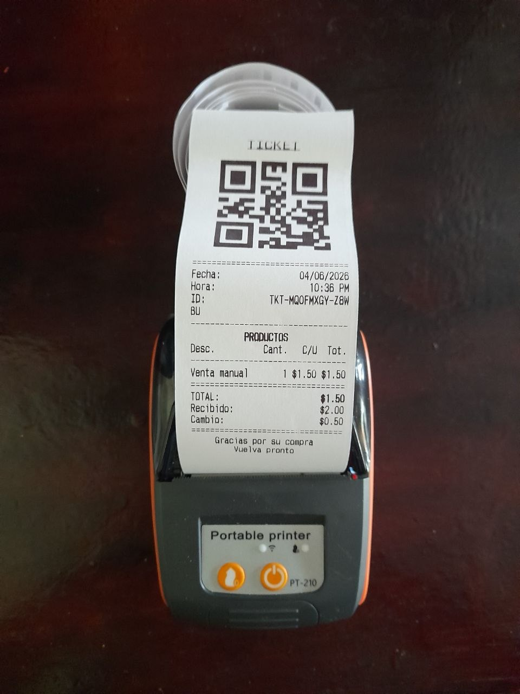

# Android-ESCPOS-Bluetooth-TCP-USB - Android ESC/POS Thermal Printer SDK
An Android library for communicating with ESC/POS thermal printers over Bluetooth, TCP, and USB connections.

> **Notice:** This library was built to serve as the thermal printer SDK for the Android app [Calculadora para Cambio](https://play.google.com/store/apps/details?id=com.volqorstudios.calculadoraparacambio). It is also designed for easy integration into your own projects, so feel free to use it.


## Acknowledgments
The following open source projects and resources served as a knowledge base and reference during the development of this library.

- [DantSu/ESCPOS-ThermalPrinter-Android](https://github.com/DantSu/ESCPOS-ThermalPrinter-Android)
  Android ESC/POS library. Reference for the Android-specific implementation patterns used in this project.

- [mike42/escpos-php](https://github.com/mike42/escpos-php)
  One of the most comprehensive ESC/POS driver implementations in any language. Its thorough documentation of command behavior, image handling, and charset encoding provided foundational understanding of the protocol.

- [anastaciocintra/escpos-coffee](https://github.com/anastaciocintra/escpos-coffee)
  Java library for ESC/POS commands that routes output to any OutputStream. Useful reference for how the protocol maps cleanly to object-oriented Java design.

- [Epson ESC/POS Command Reference](https://download4.epson.biz/sec_pubs/pos/reference_en/escpos/)
  Official Epson documentation covering the full ESC/POS command set, character code tables, and printer-specific behavior. The authoritative source for byte-level command correctness.


## Sample Output



## Android Version
Minimum supported SDK: 16 (Android 4.1 Jelly Bean).


## Installation
**Step 1.** Add the JitPack repository to your root `build.gradle`:
```groovy
allprojects {
    repositories {
        maven { url 'https://jitpack.io' }
    }
}
```

**Step 2.** Add the dependency in your app `build.gradle`:
```groovy
dependencies {
    implementation 'com.github.pusheandoando:Android-ESCPOS-Bluetooth-TCP-USB:1.0.0'
}
```


---
## Bluetooth

### Bluetooth Permissions
Add the following to your `AndroidManifest.xml`:
```xml
<uses-permission android:name="android.permission.BLUETOOTH" />
<uses-permission android:name="android.permission.BLUETOOTH_ADMIN" />
<uses-permission android:name="android.permission.BLUETOOTH_CONNECT" />
<uses-permission android:name="android.permission.BLUETOOTH_SCAN" />
```

Handle runtime permissions:
```java
if (Build.VERSION.SDK_INT < Build.VERSION_CODES.S
        && ContextCompat.checkSelfPermission(this, Manifest.permission.BLUETOOTH) != PackageManager.PERMISSION_GRANTED) {
    ActivityCompat.requestPermissions(this, new String[]{Manifest.permission.BLUETOOTH}, PERMISSION_BLUETOOTH);
} else if (Build.VERSION.SDK_INT < Build.VERSION_CODES.S
        && ContextCompat.checkSelfPermission(this, Manifest.permission.BLUETOOTH_ADMIN) != PackageManager.PERMISSION_GRANTED) {
    ActivityCompat.requestPermissions(this, new String[]{Manifest.permission.BLUETOOTH_ADMIN}, PERMISSION_BLUETOOTH_ADMIN);
} else if (Build.VERSION.SDK_INT >= Build.VERSION_CODES.S
        && ContextCompat.checkSelfPermission(this, Manifest.permission.BLUETOOTH_CONNECT) != PackageManager.PERMISSION_GRANTED) {
    ActivityCompat.requestPermissions(this, new String[]{Manifest.permission.BLUETOOTH_CONNECT}, PERMISSION_BLUETOOTH_CONNECT);
} else if (Build.VERSION.SDK_INT >= Build.VERSION_CODES.S
        && ContextCompat.checkSelfPermission(this, Manifest.permission.BLUETOOTH_SCAN) != PackageManager.PERMISSION_GRANTED) {
    ActivityCompat.requestPermissions(this, new String[]{Manifest.permission.BLUETOOTH_SCAN}, PERMISSION_BLUETOOTH_SCAN);
} else {
    // proceed
}
```

### Bluetooth Code Example
```java
ThermalPrinter printer = new ThermalPrinter(BluetoothPrinterScanner.selectFirstPaired(), 203, 48f, 32);
printer.printFormattedText(
    "[C]" + PrintImageHelper.bitmapToHex(printer, getResources().getDrawableForDensity(R.drawable.logo, DisplayMetrics.DENSITY_MEDIUM)) + "</img>\n" +
    "[L]\n" +
    "[C]<u><font size='big'>ORDER N-045</font></u>\n" +
    "[L]\n" +
    "[C]================================\n" +
    "[L]<b>ITEM ONE</b>[R]9.99\n" +
    "[L]  + Size : S\n" +
    "[L]\n" +
    "[C]--------------------------------\n" +
    "[R]TOTAL :[R]9.99\n" +
    "[L]\n" +
    "[C]<barcode type='ean13' height='10'>831254784551</barcode>\n" +
    "[C]<qrcode size='20'>https://example.com/</qrcode>\n"
);
```


---
## TCP

### TCP Permissions
Add the following to your `AndroidManifest.xml`:
```xml
<uses-permission android:name="android.permission.INTERNET" />
```

### TCP Code Example
TCP printing must run off the main thread:
```java
new Thread(() -> {
    try {
        ThermalPrinter printer = new ThermalPrinter(new NetworkConnection("192.168.1.100", 9100, 15), 203, 48f, 32);
        printer.printFormattedTextAndCut(
            "[C]<u><font size='big'>ORDER N-045</font></u>\n" +
            "[L]\n" +
            "[L]<b>ITEM ONE</b>[R]9.99\n" +
            "[C]<qrcode size='20'>https://example.com/</qrcode>\n"
        );
    } catch (Exception e) {
        e.printStackTrace();
    }
}).start();
```


---
## USB

### USB Permissions
Add the following to your `AndroidManifest.xml`:
```xml
<uses-feature android:name="android.hardware.usb.host" />
```

Handle USB permission in your activity:
```java
private static final String ACTION_USB_PERMISSION = "com.example.USB_PERMISSION";

private final BroadcastReceiver usbReceiver = new BroadcastReceiver() {
    public void onReceive(Context context, Intent intent) {
        if (ACTION_USB_PERMISSION.equals(intent.getAction())) {
            synchronized (this) {
                UsbManager usbManager = (UsbManager) getSystemService(Context.USB_SERVICE);
                UsbDevice usbDevice = intent.getParcelableExtra(UsbManager.EXTRA_DEVICE);
                if (intent.getBooleanExtra(UsbManager.EXTRA_PERMISSION_GRANTED, false)) {
                    if (usbManager != null && usbDevice != null) {
                        // print here
                    }
                }
            }
        }
    }
};

public void printUsb() {
    UsbConnection usbConnection = UsbPrinterScanner.selectFirstConnected(this);
    UsbManager usbManager = (UsbManager) getSystemService(Context.USB_SERVICE);
    if (usbConnection != null && usbManager != null) {
        PendingIntent permissionIntent = PendingIntent.getBroadcast(
            this, 0,
            new Intent(ACTION_USB_PERMISSION),
            Build.VERSION.SDK_INT >= Build.VERSION_CODES.S ? PendingIntent.FLAG_MUTABLE : 0
        );
        registerReceiver(usbReceiver, new IntentFilter(ACTION_USB_PERMISSION));
        usbManager.requestPermission(usbConnection.getDevice(), permissionIntent);
    }
}
```

### USB Code Example
```java
ThermalPrinter printer = new ThermalPrinter(new UsbConnection(usbManager, usbDevice), 203, 48f, 32);
printer.printFormattedTextAndCut(
    "[C]<u><font size='big'>ORDER N-045</font></u>\n" +
    "[L]<b>ITEM ONE</b>[R]9.99\n" +
    "[C]<barcode type='ean13' height='10'>831254784551</barcode>\n"
);
```


---
## Charset Encoding
```java
ThermalPrinter printer = new ThermalPrinter(
    deviceConnection, 203, 48f, 32,
    new PrinterCharset("windows-1252", 16)
);
```

Find the correct `charsetId` for your printer model at:
https://download4.epson.biz/sec_pubs/pos/reference_en/escpos/


---
## Formatted Text Syntax

### New Line
Use `\n` to insert a line break.

### Alignment and Columns
- `[L]` — left alignment
- `[C]` — center alignment
- `[R]` — right alignment

Multiple alignment tags on the same line create columns:
- `[L]Text` — single left-aligned column
- `[L]Left text[R]Right text` — two columns
- `[L]Col1[C]Col2[R]Col3` — three columns

### Font Size
```
<font size='normal'>text</font>
<font size='wide'>text</font>
<font size='tall'>text</font>
<font size='big'>text</font>
<font size='big-2'>text</font>
<font size='big-3'>text</font>
<font size='big-4'>text</font>
<font size='big-5'>text</font>
<font size='big-6'>text</font>
```

### Font Color
```
<font color='black'>text</font>
<font color='bg-black'>text</font>
<font color='red'>text</font>
<font color='bg-red'>text</font>
```

### Bold
```
<b>text</b>
```

### Underline
```
<u>text</u>
<u type='double'>text</u>
```

### Image
```
HEX_STRING</img>
```

Use `PrintImageHelper.bitmapToHex(printer, drawable)` to convert a drawable to a hex string.

Constraints:
- Only one alignment tag per image line, placed at the beginning.
- `</img>` must be followed immediately by `\n`.
- No other text on the same line.

### Barcode
```
<barcode>451278452159</barcode>
<barcode type='ean8'>4512784</barcode>
<barcode type='upca' height='20'>4512784521</barcode>
<barcode type='upce' height='25' width='50' text='none'>512789</barcode>
<barcode type='128' width='40' text='above'>ABC123</barcode>
<barcode type='39' width='40'>ABC123</barcode>
```

Constraints:
- Only one alignment tag per barcode line, placed at the beginning.
- `</barcode>` must be followed immediately by `\n`.
- No other text on the same line.

### QR Code
```
<qrcode>https://example.com/</qrcode>
<qrcode size='25'>data</qrcode>
```

Constraints:
- Only one alignment tag per QR code line, placed at the beginning.
- `</qrcode>` must be followed immediately by `\n`.
- No other text on the same line.


---
## API Reference

### `BluetoothPrinterScanner`
**Static** `selectFirstPaired()` -> `BluetoothDeviceConnection`
Returns the first paired Bluetooth printer found.

`getList()` -> `BluetoothDeviceConnection[]`
Returns all paired Bluetooth printers.


### `NetworkConnection(String address, int port [, int timeout])`
- `address` — IP address of the printer
- `port` — TCP port
- `timeout` *(optional)* — connection timeout in milliseconds (default: 30)


### `UsbPrinterScanner`
**Static** `selectFirstConnected(Context context)` -> `UsbConnection`
Returns the first connected USB printer.

`getList()` -> `UsbConnection[]`
Returns all connected USB printers.


### `ThermalPrinter`
**Constructor** `ThermalPrinter(DeviceConnection connection, int dpi, float widthMM, int charsPerLine [, PrinterCharset charset])`

- `connection` — connected device
- `dpi` — printer DPI
- `widthMM` — print width in millimeters
- `charsPerLine` — max characters per line
- `charset` *(optional)* — charset encoding

`disconnectPrinter()` -> `ThermalPrinter`

`printFormattedText(String text)` -> `ThermalPrinter`
Prints and feeds 20mm.

`printFormattedText(String text, float mmFeed)` -> `ThermalPrinter`

`printFormattedText(String text, int dotsFeed)` -> `ThermalPrinter`

`printFormattedTextAndCut(String text)` -> `ThermalPrinter`
Prints, feeds 20mm, and cuts.

`printFormattedTextAndCut(String text, float mmFeed)` -> `ThermalPrinter`

`printFormattedTextAndCut(String text, int dotsFeed)` -> `ThermalPrinter`

`printFormattedTextAndOpenCashBox(String text, float mmFeed)` -> `ThermalPrinter`

`printFormattedTextAndOpenCashBox(String text, int dotsFeed)` -> `ThermalPrinter`

`useEscAsteriskCommand(boolean enable)` -> `ThermalPrinter`
Switch image printing between `ESC *` and `GS v 0` commands.

`bitmapToBytes(Bitmap bitmap, boolean gradient)` -> `byte[]`


### `PrintImageHelper`
**Static** `bitmapToHex(PrinterSize printerSize, Drawable drawable [, boolean gradient])` -> `String`

**Static** `bitmapToHex(PrinterSize printerSize, BitmapDrawable drawable [, boolean gradient])` -> `String`

**Static** `bitmapToHex(PrinterSize printerSize, Bitmap bitmap [, boolean gradient])` -> `String`

**Static** `bytesToHex(byte[] bytes)` -> `String`

**Static** `hexToBytes(String hex)` -> `byte[]`


### `PrinterCharset`
**Constructor** `PrinterCharset(String charsetName, int charsetId)`

- `charsetName` — Java charset name (e.g. `windows-1252`)
- `charsetId` — ESC/POS charset ID for your printer model


### Development notes:
- Library version is defined in 'gradle.properties', in 'LIBRARY_VERSION_NAME'.